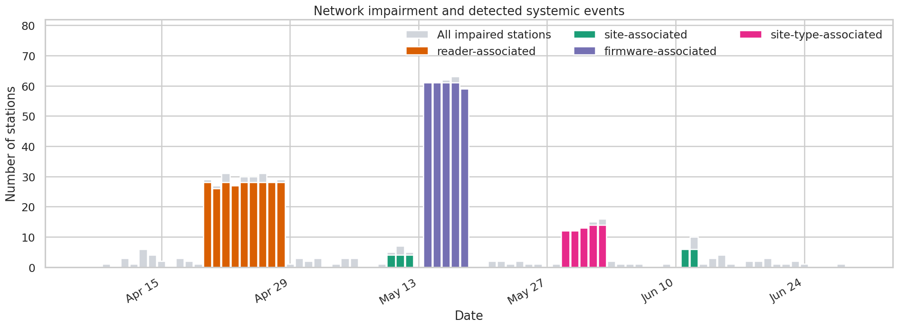

# Reliability Event Detector

Identify when EV charging performance deteriorates, which stations are affected,
and whether their shared characteristics suggest a broader problem.

The analysis follows three questions: **Is a station impaired? Is that impairment
concentrated in a shared group? How much less energy was delivered than expected?**
The example uses synthetic logs for 108 charging connectors across 18 sites over
84 days. Incident labels are not inputs to detection.

Open [analysis.ipynb](analysis.ipynb) for the exploration sandbox, worked examples,
and saved figures. It imports reusable functions from `reliability_detector/`.



## Detecting station impairment

Each station is evaluated daily using four signals:

| Signal | Detection rule |
| --- | --- |
| Authorization | Authorization successes are unusually low relative to the network baseline, using a lower-tail binomial test with `p < 0.01`. |
| Start | Successful starts are unusually low among attempts that passed authorization, using the same type of test. |
| Activity | Recorded attempts are unusually low relative to the station's same-weekday baseline, using a lower-tail Poisson test with `p < 0.01`. |
| Power delivery | At least four sessions in a day and median session power below 25 kW, or at least two sessions deliver zero kWh. |

Authorization and start baselines are the medians of daily network success
rates. A station meeting any rule is counted once as impaired.

Start success uses `sessions / (sessions + start errors)`. Authorization errors
are excluded because those attempts never reached the start stage. Otherwise,
a payment problem could be misinterpreted as a charging-start problem. A started
session can still deliver little or no energy, which is why delivery is checked
separately. Average session power is `60 * kwh / duration_min`.

## What demand shortfall measures

Here, demand is represented by **logged charging attempts**. Expected activity
is each station's median daily attempt count for the same weekday. Comparing
Mondays with Mondays accounts for weekly usage patterns, while station-specific
baselines avoid treating a normally quiet location as unhealthy.

At the station-day level:

```text
demand_pct = 100 * observed attempts / expected attempts
```

For example, six attempts against an expectation of twenty gives
`demand_pct = 30`: activity is 70% below its reference level. This does not establish that
fourteen customers were unable to charge. The impairment flag uses the Poisson
test above, rather than a fixed percentage-shortfall cutoff.

A low count could reflect an unavailable station, missing communications or
logs, or genuinely lower usage. Zero-attempt days must remain in the analysis,
otherwise the most severe activity drops would disappear. The detector includes
every station-date combination between the first and last observed attempts.

The reverse matters too: **high attempt volume can accompany poor reliability**.
One customer may retry several times after an authorization or start failure.
Those retries raise the attempt count without increasing the number of customers
or the energy delivered. This is why the notebook compares attempt volume with
delivered kWh. Elevated attempts during a failure do not show that increased
external demand caused it.

Zero-attempt days have undefined authorization and start rates. If a station's
expected activity is zero, its activity ratio is undefined and the low-activity
test is skipped.

## Systemic versus isolated impairment

An impaired station does not by itself establish a systemic problem. The next
question is whether impairment is disproportionately concentrated among stations
sharing a site, reader type, firmware version, or site type.

A one-sided Fisher exact test compares the impaired fraction **inside each group
with the fraction outside it on the same day**. Comparing proportions accounts
for group size: a widely deployed reader can have more impaired stations simply
because more stations use it.

A candidate needs at least two impaired stations and a p-value below
`0.01 / number of groups tested that day`. This daily Bonferroni adjustment makes
the threshold stricter when more groups are examined. Single-category tests use
any impairment signal. Combined firmware groups specifically compare start
impairment inside and outside the group.

“Systemic” describes a shared pattern, not necessarily a network-wide event.
Several affected stations at one site can point toward shared infrastructure.
Stations affected across sites but sharing a reader or firmware version suggest
a different investigation. These associations do not prove a root cause or,
for the any-impairment tests, that every station has the same symptom.

Likewise, an isolated station problem can persist for days. Duration alone does
not make it systemic, and failure to find a significant group does not establish
that an alert was random or harmless. Small groups can provide limited evidence.

The daily summary retains the group with the lowest p-value, breaking ties by
impaired fraction and then impaired count. This keeps the output compact, but
simultaneous problems can be omitted. A network-wide deterioration may also
produce many impaired stations without any group standing out against the rest.

## Firmware example: averages can hide a shared event

During May 14–18, two firmware versions show a sharp drop in conditional start
success that looks much milder when averaged over the whole observation period:

| Firmware | Whole-period start success | During the five-day event |
| --- | ---: | ---: |
| `v4.1.0` | 95.5% | 95.2% |
| `v4.2.0` | 87.9% | 27.5% |
| `v4.3.0` | 88.4% | 27.0% |

These rates pool sessions and observable starts within each version and period.
Daily curves expose the timing and severity of the drop, while the stable
version provides a useful comparison.

Testing one affected version against the rest places the other affected version
in its comparison group. Evaluating them together captures their shared pattern.
On May 14, the combined group includes **61 impaired stations**, compared with
**37** in the group selected when versions are tested individually. Both runs
detect the event in this dataset. The combined analysis captures more of its
scope. The notebook includes the comparison with combined-version testing disabled.

## Estimating energy shortfall

To prioritize investigation, the notebook estimates how much less energy the
selected impaired stations delivered than their usual same-weekday levels:

```text
estimated kWh shortfall = max(0, sum(expected kWh) - sum(delivered kWh))
```

Expected kWh is each station's same-weekday median. The difference is clipped
at zero after summing the selected stations, so excess delivery at one station
can offset a deficit at another. Consecutive dates with the same selected group
and event type form an episode. The Pareto chart ranks groups by summed shortfall.

This is an estimate of reduced delivery relative to typical operation. It does
not directly measure unmet customer demand, causal lost energy, or lost revenue.
Customers might charge elsewhere, and low usage can reduce delivery without a
hardware failure. The estimate covers only selected systemic station-days, so
isolated problems and other simultaneous groups are excluded.

## Reading the results

`detect_reliability_events(sites_csv, stations_csv, attempts_csv)` returns one
row per day with the total impaired-station count, the selected group's type,
station IDs, shared characteristic, and performance percentages.

The systemic station count is a subset of the total impaired count. A day with
no selected systemic group can still contain impaired stations. Daily output
percentages average selected stations' rates, excluding undefined values.
The network volume-energy plot instead divides summed observations by summed
baselines. These views use different denominators deliberately.

Baselines use the full date range, including the evaluated day and later dates,
so this is retrospective analysis. Persistent faults can depress the medians and
understate impairment or shortfall. All listed stations are assumed deployed
throughout the window, and timestamps share one artificial clock.

The statistical tests simplify variability and independence. Retries violate
independence, and station-level tests are not adjusted for multiple comparisons.
The daily group correction does not guarantee a 1% false-positive rate for the
whole analysis. Power thresholds are heuristics for this synthetic DC network.
The synthetic example demonstrates the method rather than establishing accuracy
on real charging networks.

## Code layout

| File | Responsibility |
| --- | --- |
| [analysis.ipynb](analysis.ipynb) | Run the pipeline, inspect tables, and explore the worked examples. |
| [data.py](reliability_detector/data.py) | Load CSVs, retain every station-day, and calculate metrics and weekday baselines. |
| [detection.py](reliability_detector/detection.py) | Flag station impairment, test shared groups, and select daily events. |
| [summaries.py](reliability_detector/summaries.py) | Compare firmware rates and estimate daily, episode, and group energy shortfalls. |
| [plots.py](reliability_detector/plots.py) | Draw figures from the prepared tables. |

The notebook keeps intermediate tables available for exploration. Plot functions
return a Matplotlib figure and axes, so cells control customization and saving.
Scripts can use the complete detector directly from the project folder:

```python
from reliability_detector import detect_reliability_events

daily = detect_reliability_events(
    "data/sites.csv", "data/stations.csv", "data/attempts.csv",
)
```

## Run locally

Use Python 3.12. From the project folder:

```bash
python -m venv .venv
source .venv/bin/activate
python -m pip install -r requirements.txt jupyterlab
python -m jupyter lab analysis.ipynb
```

Run cells in order. After editing a module, restart the notebook kernel and run
all cells to load the changes. The three input CSVs are included in `data/`. The optional
[generator](generate_data.py) records the simulation assumptions and incident
schedule. To regenerate the CSVs, overwriting the included copies:

```bash
python generate_data.py --output-dir data --seed 20260927
```

Run the focused regression checks from the project folder:

```
python -m unittest discover -s tests
```
